# Executive Summary

Design the Rust notepad with Material Design principles adapted for desktop. **Use native menus and toolbars** instead of Material mobile navigation. **Follow platform conventions (Windows/macOS/Linux)** for menus, dialogs, and shortcuts. **Map Material components to desktop UI** (see table below) and adjust sizes, padding, colors, and states to match desktop norms. **Implement full keyboard support** (Alt/Cmd shortcuts, tab order, drag/drop, focus rings). Ensure **accessibility**: high-contrast text (WCAG 4.5:1), proper labels for screen readers, and scalable UI. Provide **light and dark themes** that integrate with system settings; use recommended fonts (e.g. Segoe UI on Windows, San Francisco on macOS, Roboto/Inter cross-platform) at readable sizes (≈16px body, 20–24px headings). **Use a consistent spacing grid** (e.g. 8px) and allow window resizing (target minimum 800×600)【50†L99-L104】【51†L1-L4】. **Animate sparingly** (100–300ms fades/slides) and respect “reduce motion” settings. Finally, include a comprehensive testing matrix (OS vs. feature) and QA checklist (contrast, keyboard nav, hover states【64†L139-L144】【64†L116-L123】). The following sections give direct, actionable guidelines and specs for each aspect.

## Material Design on Desktop (Applicability)

- **Use Material’s visual language** (grid spacing, iconography, color roles) for consistency, but **adapt to desktop UX patterns**. For example, replace Material *Bottom Navigation* with a standard menu bar or sidebar.
- **Replace FABs:** Desktop apps rarely use floating action buttons【5†L19-L22】. Instead, place primary actions (New, Open, Save) as toolbar buttons or menu items. If only one main action exists, a large button in the toolbar is acceptable.
- **Leverage Material spacing:** Use an 8px (or 4px) grid for layout. Maintain at least 8px padding around controls. E.g., set 16px margin between editor and window edges.
- **Maintain Material theming:** Use Material’s color tokens (primary, secondary, error, etc.), but allow overriding by system theme. For a generic notepad, pick a neutral primary (e.g. Material Blue) and neutral background (light or dark). Define CSS tokens (e.g. `--primary: #6200EE; --on-primary: #FFFFFF;`).

## Platform-Specific Adaptations

- **Windows:** Use a window-embedded menu bar (File, Edit, View, Help). Place **File, Edit, View, Help** menus at top. Use Alt+letter mnemonics for menus and commands【25†L56-L60】. Minimize and maximize buttons in title bar; test at standard DPI (100%, 125%, 150%)【50†L99-L104】.
- **macOS:** Use the global menu bar. Place **Preferences** under the app menu (e.g. “Notepad > Preferences” instead of File). Use Command (⌘) shortcuts (e.g. ⌘C, ⌘S) and standard macOS UI fonts (San Francisco). Provide “Open Recent” in File menu as per macOS norms.
- **Linux (GTK/KDE):** Follow Windows conventions. Use in-window menu bar and GTK style. Ensure menus and dialogs use native theming (e.g. Adwaita). Support high-DPI scaling similarly to Windows.
- **Dialogs:** On all platforms, use native file-open/save and alert dialogs. Keep dialogs modal and appropriately sized (e.g. ~400×300px for alerts). Title dialogs clearly (e.g. “Open File”). Provide Cancel and OK buttons on dialogs.
- **Window Behavior:** Allow windows to be resizable (maximize enabled). Set minimum window size to accommodate UI (∼800×600). On Windows, avoid the old resize gripper – modern windows are resizable by default【50†L135-L142】.

## Component Mapping (Material → Desktop)

| Material Component           | Desktop Equivalent                      | Actionable Adaptation                                                                                                                                                                                                                         |
|------------------------------|-----------------------------------------|-----------------------------------------------------------------------------------------------------------------------------------------------------------------------------------------------------------------------------------------------|
| **Top App Bar**              | **Window Title Bar + Toolbar**          | Include document title in title bar. Place common actions (New/Open/Save) as toolbar icons next to title. Keep toolbar background solid (no transparent scroll).                                                                              |
| **Bottom Navigation**        | **Sidebar / No direct equivalent**      | Omit. Use a left sidebar or top tabs if multiple views are needed.                                                                                                                                                                            |
| **Floating Action Button**   | **Toolbar Button / Primary Button**     | Remove FAB. Put primary action (e.g. “New File”) as a toolbar icon or primary menu item.                                                                                                                                                      |
| **Buttons (Contained/Text)** | **Desktop Buttons**                     | Use standard buttons (flat or raised). Default size ≥32×32 px on toolbar, larger (≥48×48) if emphasizing. Provide hover (lighten background) and active states.                                                                               |
| **Menus**                    | **Menu Bar & Context Menus**            | Implement standard cascaded menus: File, Edit, etc. Group similar items (e.g. multiple New* commands) into submenus【25†L64-L71】. Use separators (―) between groups【25†L52-L60】. Do **not** hide commands; disable if unavailable【25†L81-L88】. |
| **Dialogs**                  | **Modal Dialog Windows**                | Use native dialogs. E.g. file picking, confirmation dialogs. Keep them smaller than main window. Ensure text and buttons follow desktop metrics.                                                                                              |
| **Text Fields / Editor**     | **Multiline Text Edit Control**         | Use a scrollable text view. Ensure padding ~8px inside. Support typical shortcuts (Ctrl/Cmd+Z/Y, Ctrl/Cmd+A/C/V). Use monospace or sans font, 16px default.                                                                                   |
| **Checkboxes / Radios**      | **Standard Check/Radio Controls**       | Use OS-native checkboxes and radio buttons for options (e.g. word wrap toggle). Maintain Material color for checked state (blue on light theme).                                                                                              |
| **Switch**                   | **Toggle Switch**                       | Use switch control for boolean prefs (e.g. Show Line Numbers). Follow desktop style (e.g. off/on labels).                                                                                                                                     |
| **Tabs**                     | **Window Tabs**                         | Use a tab bar at top of document area if multi-document. Follow platform tab style (e.g. Chrome-like on Windows, unified style on Mac).                                                                                                       |
| **Bottom Sheet**             | **Drawer or Panel**                     | Not applicable. Use side panels or dialogs for additional content (e.g. search).                                                                                                                                                              |
| **Snackbars/Toasts**         | **Status Bar Messages / Notifications** | Show non-critical messages in status bar (e.g. “File saved”). For critical alerts use dialogs. Avoid mobile-style toasts unless subtle desktop notifications.                                                                                 |
| **Icons**                    | **Toolbar Icons**                       | Provide 24×24px icons (SVG/PNG) in a consistent style. Use Material icons (outlined style) or system glyphs. For dark mode, use white/light icons; for light mode use dark icons.                                                             |
| **Typography**               | **System Font**                         | Use a legible sans-serif. On Windows use Segoe UI; on Mac SF Pro; cross-platform, Roboto/Inter. Body text ~16px, headings 18–24px. Use 1.5 line-height.                                                                                       |

*Rationale:* Follow official guidelines: unique mnemonic keys for menus【25†L56-L60】, use one level of cascading【25†L64-L71】, and include all commands even if disabled【25†L81-L88】. The table above maps each Material UI pattern to standard desktop patterns.

## Component Specifications

- **Buttons:** Minimum 32×32 px (24dp icon + 8px padding). Larger (e.g. 40×40 px) for emphasis. Use **Fill Color** for primary (e.g. #6200EE on light, #BB86FC on dark) with white text, and **Outlined** or **Text** style for secondary actions. Hover: increase brightness by ~10%. Press: darken background (use 200ms animation). Disabled: gray (#D1D1D1) background with 50% opacity text.
- **Text Editor:** Background white (#FFFFFF) in light theme, dark gray (#121212) in dark. Text color black/#000000 or white/#FFFFFF respectively. Use a 1px inset border (#CCCCCC) around the editor. Padding: 8px all around. Default font 16px (roboto/sans-serif). Cursor color matches accent.
- **Menus:** Use 14px font. Menu item height ~24px. Separator: 1px gray line. Checked state: use a checkmark icon (or ▶ for radio) on left. Mnemonic underline on Windows (enable underlines under Alt key【25†L56-L60】). Disabled items: 50% opacity.
- **Dialog Windows:** Title font 16px bold. Content font 14px. Window padding: 12px. Buttons in dialog: 32×32 px, 8px spacing between. On Windows, use “OK/Cancel” order (OK on left); on macOS, use “Cancel” on left.
- **Icons:** Provide at least 2 pixel densities (1×, 2×). Align icons on an 24px grid. Use color tokens or match theme (blue for “info” icons, red #B00020 for error). Ensure alt text for accessibility.
- **Colors:** Define tokens, e.g. `--color-primary: #6200EE; --color-secondary: #03DAC6; --color-bg-light: #FFFFFF; --color-bg-dark: #121212; --color-surface: #F5F5F5; --color-error: #B00020`. Use them consistently. Maintain contrast ≥4.5:1 for text【64†L139-L144】.

## Interaction Rules

- **Keyboard Shortcuts:** Support standard shortcuts (Ctrl/Cmd+N/O/S for new/open/save; Ctrl/Cmd+Z/Y undo/redo; Ctrl/Cmd+C/V/X copy/paste/cut; Ctrl/Cmd+F find; Ctrl/Cmd+A select all). Show shortcuts in menu hints.
- **Mnemonics:** Assign Alt+Letter on Windows menus (e.g. Alt+F for File)【25†L56-L60】. On macOS, use Cmd modifiers instead and display ⌘ symbol.
- **Focus & Tab Order:** Ensure logical tabbing through all controls. Visible focus highlight (glow/outline) on focused buttons, inputs, menus. For example, tab order: (Menu Bar) → Toolbar → Editor → Status Bar.
- **Drag & Drop:** Allow dragging a file onto the window to open it. Enable text drag-selection to move text. Show an appropriate drop cursor/icon.
- **Clipboard:** Implement Cut/Copy/Paste on text selection and on files (e.g. copy file path). Use system clipboard APIs so keyboard shortcuts work.
- **Window Management:** Add Close/Minimize/Maximize in the title bar. Default action on close with unsaved changes: prompt “Save changes?” dialog. Remember last window position/size. On multi-monitor setups, open on the active monitor.

## Accessibility Checklist

- **Keyboard Navigation:** Verify all functionality is operable via keyboard alone. Tab between buttons, menus, and editor fields. Focus must always be visible.
- **Screen Reader Labels:** Provide `aria-label` or equivalent for all buttons/menus (e.g. “New File”, “Open”). Group related controls (e.g. radio buttons with same name). Announce error dialogs.
- **Contrast:** Ensure text/icons meet WCAG 2.0 contrast ratio ≥4.5:1【64†L139-L144】 (e.g. black on white or white on dark). Provide a high-contrast theme if possible.
- **Scalability:** Test UI at 125% and 150% scale (120dpi, 144dpi). Text and controls should reflow and remain usable【50†L99-L104】.
- **Accessible Fonts:** Use at least 16px base font. Avoid small text (<12px). Support system font-size adjustments if OS allows.
- **Test Assistive Tech:** Verify with screen readers (NVDA/JAWS on Windows, VoiceOver on Mac). All actions should be announced.
- **Spacing and Hit Targets:** Ensure clickable targets are ≥20×20 px. There should be ≥8px spacing around interactive elements to avoid crowding【64†L129-L134】.

## Theming & Branding

- **Light/Dark Themes:** Provide both. In **light mode**, use dark text (#000000) on white (#FFFFFF) surfaces. In **dark mode**, use white text (#FFFFFF) on dark backgrounds (#121212). Use semi-transparent surfaces for raised elements (e.g. toolbar #222222 with 80% opacity).
- **System Integration:** Detect OS dark/light preference and switch themes. For Windows 10+, follow system accent color for highlights (e.g. focus ring). On macOS, sync with system’s Light/Dark.
- **Fonts:** Use UI fonts: Windows – Segoe UI (14–16px body), macOS – SF Pro (13–15px). For cross-OS, Roboto or Inter (16px) is a good neutral choice【55†L49-L53】. Use bold for headings and toolbar titles.
- **Iconography:** Use Material Icons (outline style) or system icons. Size icons at 24×24 px for toolbars, 16×16 px for dialogs/menus. Provide both filled and outline variants for hover/active. Maintain consistent stroke weight.
- **Color Tokens:** Define and reuse tokens (as above). For example, `--theme-accent` used for link text and active states. Update colors in one place to maintain consistency.

## Layout, Spacing, Density

- **Grid:** Base spacing = 8px. Align all elements to this grid. For example, make toolbar height 48px, editor margin 8px, status bar 24px high.
- **Window Size:** Design for ≥800×600 px. Make all dialogs and menus functional at 640×480.
- **Density:** Desktop allows tighter layout than mobile. Controls can be closer (4px apart horizontally if needed) but don’t go below 4px. Prefer 8px for vertical spacing between form fields.
- **Responsive Behavior:** If window is wide, use two-column layouts (e.g. tool settings beside editor). If narrow, stack elements vertically and use scrolling.
- **Readability:** Limit text line length in editor to ~65 characters for comfort【51†L1-L4】. Wrap text at window edge. Avoid horizontal scrolling of documents if possible.

## Animations & Motion

- **Timing:** Use subtle transitions for showing/hiding panels or dialogs (fade 150–250ms). Animate progress (e.g. progress bar fill in 300ms).
- **Reduce Motion:** Check OS reduce-motion setting. If enabled, **disable all nonessential animations** and use simple state changes.
- **Type of Motion:** Avoid page swipes or slides; use cross-fade or slide-ins. For example, toolbar menus can fade in/out quickly.
- **Feedback:** Provide instant visual feedback on actions (button press highlight) and only small delays (≤100ms) if needed.

## Testing & QA

**Accessibility QA Checklist:**
- Test keyboard-only workflow: menus, dialogs, toolbar all reachable by Tab/Alt/Cmd.
- Verify focus indicators are visible.
- Check color contrast with a tool (accept ≥4.5:1)【64†L139-L144】.
- Validate screen-reader announcements.
- Confirm scalable layouts at high DPI.

**Functional Tests:**
- **File Operations:** Test Open, Save, Save As on each OS’s default directories.
- **Editing:** Verify Undo/Redo, Copy/Paste, Find/Replace work.
- **Menus & Shortcuts:** Ensure every menu item corresponds to a shortcut (and vice versa). Test Alt/Cmd shortcuts.
- **Drag/Drop:** Try dropping a file into the app. Test dragging text.
- **Dialogs:** Open preferences, error dialogs (e.g. Cancel Save). Buttons do what they promise.
- **Window Management:** Maximize, minimize, close, multi-monitor. State (unsaved changes) properly handled on close.
- **Theme Switching:** Toggle OS theme; verify app switches color scheme.

**OS × Feature Testing Matrix:**

| Feature / OS      | Windows           | macOS             | Linux (GTK)        |
|-------------------|-------------------|-------------------|--------------------|
| File Open/Save    | ✔ Open native dialog; ✓ Save works | ✔ Uses macOS dialog; ✓ Save works | ✔ Uses GTK dialog; ✓ Save works |
| Undo/Redo (CtrlZ/Y) | ✔ Works; Shortcut shown in Edit menu | ✔ ⌘Z/⇧⌘Z work | ✔ Works |
| Copy/Paste (CtrlC/V)| ✔ Works; Confirm Clipboard | ✔ ⌘C/⌘V work | ✔ Works |
| Preferences location | ✔ In Edit or Tools menu | ✔ In App menu | ✔ In Edit/Tools menu |
| Dark Mode support | ✔ Follows Windows dark setting | ✔ Follows system dark/light | ✔ Follows GTK theme |
| High-DPI (125%,150%)| ✔ UI scales properly | ✔ UI scales | ✔ UI scales |

Adjust the above as needed for actual behavior during QA.

## Migration & Trade-offs

- **UI Consistency vs Platform Familiarity:** Always prefer user expectations. E.g. on Mac, user expects “Preferences” under the app menu. On Windows, Ribbon-style UIs are discouraged; use classic menu.
- **Branding vs Native Look:** A fully Material-styled UI (custom colors/controls) stands out but may feel foreign on each OS. Decide if custom theming is worth it. You can mix: e.g., native dialogs but custom toolbar style.
- **Feature Coverage:** Material has many components; prioritize what desktop needs. For example, skip mobile-only elements (bottom sheets, FAB) and focus on desktop essentials (menus, dialogs, tooltips).
- **Library Choice:** Using a Rust GUI toolkit may impose limitations (e.g. Iced might not have native menu bar). Factor this into design trade-offs. If a toolkit lacks a feature (like native menu support), implement fallback UI (e.g. a toolbar menu button).

## File Flow Diagram

```mermaid
flowchart LR
    U[User] --> M["Click File \u003e Open"]
    M --> D["Show Open Dialog"]
    D --> F["Select file and confirm"]
    F --> L["Load file into editor"]
    L --> E[Editor displays content]
    E --> U2["User edits text"]
    U2 --> SM["Click File \u003e Save"]
    SM --> SD["Show Save Dialog (if new)"]
    SD --> SV["File saved to disk"]
    SV --> SBar["Status shows 'File saved'"]
```

The above flowchart shows the common **Open → Edit → Save** sequence. Ensure each arrow corresponds to actual code: e.g. “Load file” triggers a read-into-editor action, “Save” triggers file write.